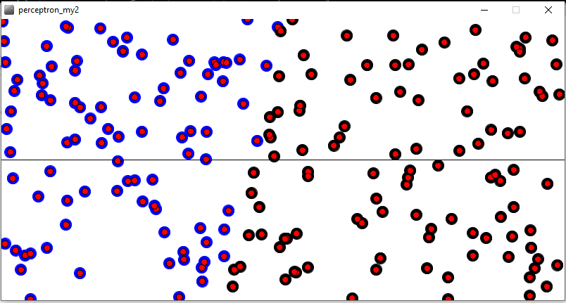
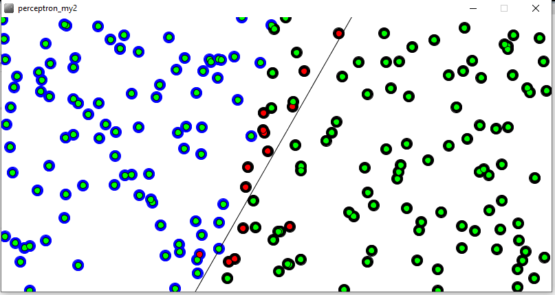
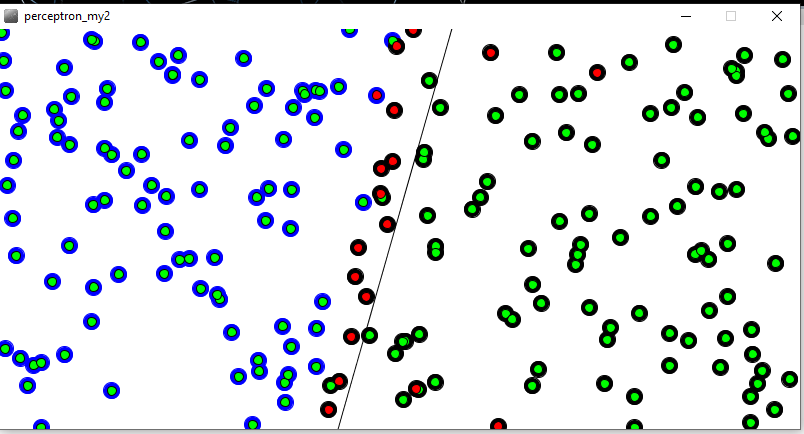
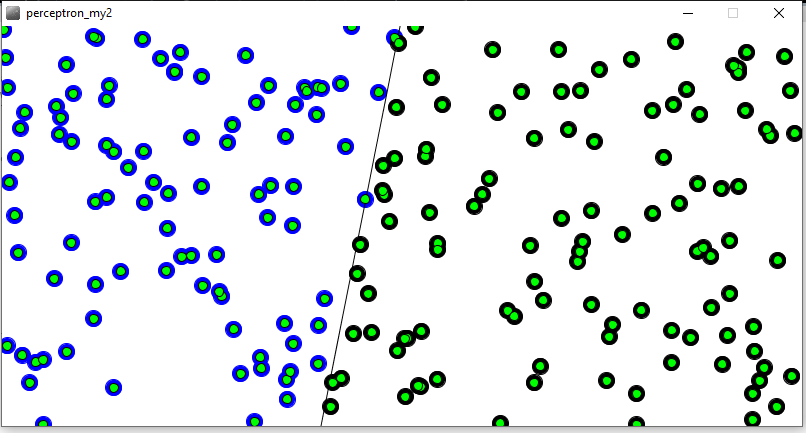

# perceptron_model
In this project I made a perceptron model in processing model in which for every mouse click it's train for 100 iterations and you can viewlize the result after each action.
Here we have two classes 1 and 0...

after first click

second click and so on

